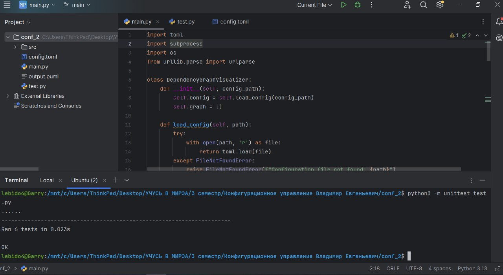
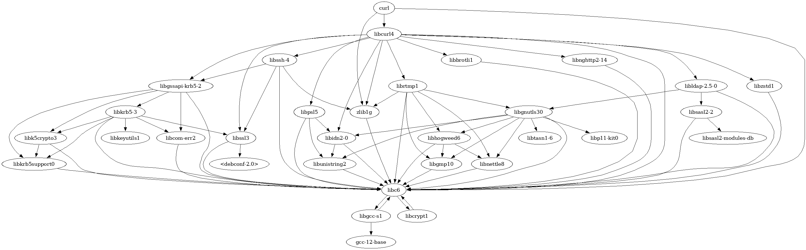

## Визуализатор графа зависимостей

Инструмент командной строки для визуализации зависимостей пакетов (включая транзитивные) для пакетов Ubuntu в формате PlantUML. Программа анализирует зависимости с помощью `apt-cache`, генерирует файл PlantUML и при необходимости визуализирует граф зависимостей в виде изображения.

### Основные возможности

- Анализ зависимостей для любого пакета Ubuntu.
- Поддержка транзитивного разрешения зависимостей с настраиваемой глубиной.
- Вывод графа в формате PlantUML.
- Автоматическое создание визуализации графа зависимостей (требуются PlantUML и Java).

### Требования

- Python 3.x
- `apt-cache` (команда менеджера пакетов Ubuntu/Debian)
- Java (для работы PlantUML)
- JAR-файл PlantUML (`plantuml.jar`)
- Python-модуль `toml`

### Установка

1. Склонируйте репозиторий:
   ```bash
   git clone <repository-url>
   cd <repository-directory>
   ```

2. Установите необходимый Python-модуль:
   ```bash
   pip install toml
   ```

3. Убедитесь, что `apt-cache` и Java установлены:
   ```bash
   sudo apt update
   sudo apt install apt-utils default-jre
   ```

4. Загрузите JAR-файл PlantUML:
   [Страница загрузки PlantUML](https://plantuml.com/download)

### Конфигурация

Создайте конфигурационный файл TOML со следующим содержимым:

```toml
visualizer_path = "/path/to/plantuml.jar"  # Путь к JAR-файлу PlantUML
package_name = "curl"                 # Пакет для анализа
result_path = "./output.puml"         # Путь для сохранения файла PlantUML
max_depth = 3                          # Максимальная глубина анализа зависимостей
repository_url = "http://archive.ubuntu.com/ubuntu"  # URL репозитория
```

### Использование

1. Запустите инструмент с файлом конфигурации:
   ```bash
   python3 main.py config.toml
   ```

2. Граф зависимостей будет сохранён в файл `.puml` по указанному в `result_path` пути.

3. Если PlantUML настроен, программа автоматически создаст изображение (например, PNG) и откроет его.

### Тестирование



Для проверки работы инструмента доступны юнит-тесты:

1. Запустите тесты:
   ```bash
   python3 -m unittest test_dependency_graph_visualizer.py
   ```


2. Результаты тестирования будут отображены в консоли.

